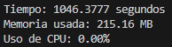

# Web Scraping Simple de Libros desde Books to Scrape (**requests**, **lxml**, **XPath**)

Este script en Python realiza un **web scraping** del sitio [Books to Scrape](https://books.toscrape.com), extrayendo información relevante de los libros disponibles. 

## Metadatos
- Title: título del libro
- Stars: puntuación en estrellas
- Price (euros): precio del libro en  euros
- Stock: cantidad de libros disponibles
- Category: categoría a la que pertenece el libro. ej: Travel, Mystery, Historical Fiction, etc.
- Description: Descrición del libro
- UPC: código único que identifica el producto en el catálogo
- Product Type: Tipo de producto
- Price (excl. tax): precio del producto antes de aplicar impuestos
- Price (incl. tax): precio total del producto incluyendo impuestos
- Tax: valor del impuesto aplicado al producto
- Number of reviews: número de reseñas
- Image: imagen de la tapa del libro
- Link: enlace a la publicación del libro
- Date: Fecha de la extracción de los datos del libro


## Requisitos

Antes de ejecutar el script, asegúrate de tener instaladas las siguientes bibliotecas de Python:

- **requests**: Para realizar solicitudes HTTP.
- **lxml**: Para el procesamiento de HTML y la extracción de datos utilizando XPath.

### Instalación de dependencias

Puedes instalar las dependencias necesarias usando `pip`:

```bash
pip install requests lxml
```
o tambien puedes intalar las dependencias del archivo requirements.txt

```bash
pip install -r requirements.txt
```

## Descripción del Script 

1. **Solicitud de Páginas**: El script navega por todas las páginas del sitio web, comenzando desde la página 1 hasta la última página disponible en el catálogo.
2. **Extracción de Datos**: Para cada libro encontrado, se extraen los siguientes que describo en los metadatos de este readme.
3. **Guardado en JSON**: Toda la información recopilada se almacena en un archivo llamado `libros.json`.


## Consideraciones

- Este script está diseñado con fines educativos y de práctica de **web scraping**. La misma página [Books to Scrape](https://books.toscrape.com) tiene estos fines.
- Si bien este codigo es simple, en la posteridad realizaré lo mismo pero para un entorno big data  y con hilos, así quede a disposición este codigo sencillo de extracción de datos y el completo.
- Tuve que usar un time.sleep en la sección de obtención de datos de cada libro porque al parecer la página no permite tantas solicitudes en poco tiempo.
- Resulta gracioso que tenga que usar un time.sleep(0.2) y el script se ejecute en 1046 segundos aproximadamente (como muestro en la imagen) y con selenium siguiendo la misma estructura de scraping pero en luhar de un time.sleep uso WebDriverWait tarde casi la mitad de tiempo siendo 676 segundos aproximadamente [adjunto aquí el enlace al script con selenium](https://github.com/Esdasan180/Web_Scraping_Simple-Selenium_XPath_WebDriverWait). Es decir que hay cosas por mejorar en este script que será modificado en cuanto sea solucionado porque resulta raro que usando selenium puedo ahorrar tiempo de ejecusión.

### script con request



## Problemas Comunes

- **Error de conexión**: Si el sitio está caído o hay problemas de red, el script mostrará un mensaje de error.
- **Cambios en la estructura del sitio**: Si la estructura del HTML cambia, los XPath utilizados pueden dejar de funcionar correctamente.

## Objetivo

Este script fue creado para practicar técnicas de **web scraping** utilizando **requests** y **lxml** para aplicar **XPath**.
